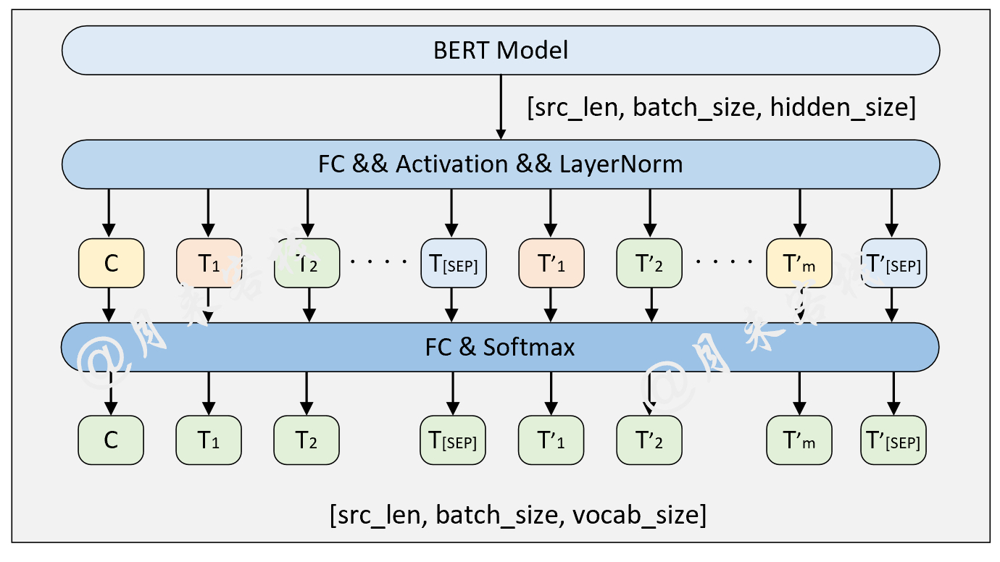

# BERT 预训练任务（基于宋词语料）

## 1. 项目介绍

本项目使用 **BERT-base-chinese** 作为基座模型，在 **宋词语料库（SongCi）** 上进行 **大规模的 Masked Language Model (MLM) 预训练**，以提升 BERT 在古典中文语境下的理解能力。

**核心任务：**

- 采用 **MLM（Masked Language Model）** 任务进行无监督预训练。
- 训练数据来自 **宋词语料库**，格式化为 BERT 训练所需格式。
- 训练过程中 **动态 Masking** 15% 的 token。
- 使用 **GPU 加速训练**，支持 TensorBoard 监控。

## 2. 目录结构

```css
BERT/
├── data/                          # 数据存放目录
│   ├── SongCi/                     # 宋词预训练数据
│   │   ├── songci.train.txt         # 训练集
│   │   ├── songci.valid.txt         # 验证集
│   │   ├── songci.test.txt          # 测试集
│
├── logs/                          # 训练日志
│   ├── logs_songci_2025-02-28.txt   # 训练日志
│   ├── songci_2025-03-03.txt        # 预测日志
│
├── model/                         # 预训练 BERT 模型
│   ├── BasicBert/                  # BERT 基础模块
│   │   ├── Bert.py                  # BERT 主体结构
│   │   ├── BertConfig.py            # BERT 配置文件解析
│   │   ├── BertEmbedding.py         # BERT 嵌入层
│   │   ├── MyTransformer.py         # Transformer 实现
│
├── Tasks/                         # 训练任务脚本
│   ├── TaskForPretraining.py        # BERT 预训练任务（MLM）
│
├── utils/                          # 工具代码
│   ├── create_pretraining_data.py   # 预训练数据格式化
│   ├── data_helpers.py              # 数据处理
│   ├── log_helper.py                # 训练日志记录
│
├── README.md                       # 本说明文档
```

## 3. 预训练环境

### 3.1 安装依赖

```
conda create -n bert python=3.10 -y
conda activate bert

pip install torch torchvision -i https://pypi.tuna.tsinghua.edu.cn/simple/ 
pip install torchtext -i https://pypi.tuna.tsinghua.edu.cn/simple/
pip install transformers -i https://pypi.tuna.tsinghua.edu.cn/simple/
pip install pandas -i https://pypi.tuna.tsinghua.edu.cn/simple/
pip install scikit-learn -i https://pypi.tuna.tsinghua.edu.cn/simple/
```

### 3.2 下载 BERT 预训练模型

- `bert_base_chinese`目录中是BERT base中文预训练模型以及配置文件

  模型下载地址：https://huggingface.co/bert-base-chinese/tree/main

- `bert_base_uncased_english`目录中是BERT base英文预训练模型以及配置文件

  模型下载地址：https://huggingface.co/bert-base-uncased/tree/main

  注意：`config.json`中需要添加`"pooler_type": "first_token_transform"`这个参数

## 4. 数据预处理

### 4.1 训练数据格式

`SongCi`是宋词语料用于中文模型预训练

每一行是一句话，例如：

```css
皇图大业超前古，垂象泰阶平。
```

### 4.2 生成 BERT 训练格式的数据

使用 `create_pretraining_data.py` 进行预处理：

```shell
python SongCi/read.py
python utils/create_pretraining.py
```

## 5. 预训练 BERT




### 5.1 训练参数

- **batch_size**: 16
- **learning_rate**: 4e-5
- **epochs**: 100
- **masked_rate**: 15%
- **设备**: `cuda:0`

### 5.2 启动训练

```shell
python Tasks/TaskForPretraining.py
```

### 5.3 训练日志示例

```css
[2025-02-28 01:10:41] - INFO: 成功导入BERT配置文件 /root/epfs/bert_base_chinese/config.json
[2025-02-28 01:10:41] - INFO:  ### 将当前配置打印到日志文件中 
[2025-02-28 01:10:41] - INFO: ### project_dir = /root/epfs
[2025-02-28 01:10:41] - INFO: ### dataset_dir = /root/epfs/data/SongCi
[2025-02-28 01:10:41] - INFO: ### pretrained_model_dir = /root/epfs/bert_base_chinese
[2025-02-28 01:10:41] - INFO: ### train_file_path = /root/epfs/data/SongCi/songci.train.txt
[2025-02-28 01:10:41] - INFO: ### val_file_path = /root/epfs/data/SongCi/songci.valid.txt
[2025-02-28 01:10:41] - INFO: ### test_file_path = /root/epfs/data/SongCi/songci.test.txt
[2025-02-28 01:10:41] - INFO: ### data_name = songci
[2025-02-28 01:10:41] - INFO: ### vocab_path = /root/epfs/bert_base_chinese/vocab.txt
[2025-02-28 01:10:41] - INFO: ### device = cuda:0
[2025-02-28 01:10:41] - INFO: ### model_save_dir = /root/epfs/cache
[2025-02-28 01:10:41] - INFO: ### logs_save_dir = /root/epfs/logs
[2025-02-28 01:10:41] - INFO: ### model_save_path = /root/epfs/cache/model_songci.bin
[2025-02-28 01:10:41] - INFO: ### writer = <torch.utils.tensorboard.writer.SummaryWriter object at 0x7fa859497fa0>
[2025-02-28 01:10:41] - INFO: ### is_sample_shuffle = True
[2025-02-28 01:10:41] - INFO: ### use_embedding_weight = True
[2025-02-28 01:10:41] - INFO: ### batch_size = 16
[2025-02-28 01:10:41] - INFO: ### max_sen_len = None
[2025-02-28 01:10:41] - INFO: ### pad_index = 0
[2025-02-28 01:10:41] - INFO: ### random_state = 2022
[2025-02-28 01:10:41] - INFO: ### learning_rate = 4e-05
[2025-02-28 01:10:41] - INFO: ### weight_decay = 0.1
[2025-02-28 01:10:41] - INFO: ### masked_rate = 0.15
[2025-02-28 01:10:41] - INFO: ### masked_token_rate = 0.8
[2025-02-28 01:10:41] - INFO: ### masked_token_unchanged_rate = 0.5
[2025-02-28 01:10:41] - INFO: ### log_level = 10
[2025-02-28 01:10:41] - INFO: ### use_torch_multi_head = False
[2025-02-28 01:10:41] - INFO: ### epochs = 100
[2025-02-28 01:10:41] - INFO: ### model_val_per_epoch = 1
[2025-02-28 01:10:41] - INFO: ### vocab_size = 21128
[2025-02-28 01:10:41] - INFO: ### hidden_size = 768
[2025-02-28 01:10:41] - INFO: ### num_hidden_layers = 12
[2025-02-28 01:10:41] - INFO: ### num_attention_heads = 12
[2025-02-28 01:10:41] - INFO: ### hidden_act = gelu
[2025-02-28 01:10:41] - INFO: ### intermediate_size = 3072
[2025-02-28 01:10:41] - INFO: ### pad_token_id = 0
[2025-02-28 01:10:41] - INFO: ### hidden_dropout_prob = 0.1
[2025-02-28 01:10:41] - INFO: ### attention_probs_dropout_prob = 0.1
[2025-02-28 01:10:41] - INFO: ### max_position_embeddings = 512
[2025-02-28 01:10:41] - INFO: ### type_vocab_size = 2
[2025-02-28 01:10:41] - INFO: ### initializer_range = 0.02
[2025-02-28 01:10:41] - INFO: ### architectures = ['BertForMaskedLM']
[2025-02-28 01:10:41] - INFO: ### directionality = bidi
[2025-02-28 01:10:41] - INFO: ### layer_norm_eps = 1e-12
[2025-02-28 01:10:41] - INFO: ### model_type = bert
[2025-02-28 01:10:41] - INFO: ### pooler_fc_size = 768
[2025-02-28 01:10:41] - INFO: ### pooler_num_attention_heads = 12
[2025-02-28 01:10:41] - INFO: ### pooler_num_fc_layers = 3
[2025-02-28 01:10:41] - INFO: ### pooler_size_per_head = 128
[2025-02-28 01:10:41] - INFO: ### pooler_type = first_token_transform
[2025-02-28 01:10:43] - DEBUG: ## 成功将参数:bert.embeddings.word_embeddings.weight赋值给bert_embeddings.word_embeddings.embedding.weight,参数形状为:torch.Size([21128, 768])
[2025-02-28 01:10:43] - DEBUG: ## 成功将参数:bert.embeddings.position_embeddings.weight赋值给bert_embeddings.position_embeddings.embedding.weight,参数形状为:torch.Size([512, 768])
[2025-02-28 01:10:43] - DEBUG: ## 成功将参数:bert.embeddings.token_type_embeddings.weight赋值给bert_embeddings.token_type_embeddings.embedding.weight,参数形状为:torch.Size([2, 768])
[2025-02-28 01:10:43] - DEBUG: ## 成功将参数:bert.embeddings.LayerNorm.gamma赋值给bert_embeddings.LayerNorm.weight,参数形状为:torch.Size([768])
[2025-02-28 01:10:43] - DEBUG: ## 成功将参数:bert.embeddings.LayerNorm.beta赋值给bert_embeddings.LayerNorm.bias,参数形状为:torch.Size([768])
[2025-02-28 01:10:43] - DEBUG: ## 成功将参数:bert.encoder.layer.0.attention.self.query.weight赋值给bert_encoder.bert_layers.0.bert_attention.self.multi_head_attention.q_proj.weight,参数形状为:torch.Size([768, 768])
[2025-02-28 01:10:43] - DEBUG: ## 成功将参数:bert.encoder.layer.0.attention.self.query.bias赋值给bert_encoder.bert_layers.0.bert_attention.self.multi_head_attention.q_proj.bias,参数形状为:torch.Size([768])
[2025-02-28 01:10:43] - DEBUG: ## 成功将参数:bert.encoder.layer.0.attention.self.key.weight赋值给bert_encoder.bert_layers.0.bert_attention.self.multi_head_attention.k_proj.weight,参数形状为:torch.Size([768, 768])
[2025-02-28 01:10:43] - DEBUG: ## 成功将参数:bert.encoder.layer.0.attention.self.key.bias赋值给bert_encoder.bert_layers.0.bert_attention.self.multi_head_attention.k_proj.bias,参数形状为:torch.Size([768])
[2025-02-28 01:10:43] - DEBUG: ## 成功将参数:bert.encoder.layer.0.attention.self.value.weight赋值给bert_encoder.bert_layers.0.bert_attention.self.multi_head_attention.v_proj.weight,参数形状为:torch.Size([768, 768])
[2025-02-28 01:10:43] - DEBUG: ## 成功将参数:bert.encoder.layer.0.attention.self.value.bias赋值给bert_encoder.bert_layers.0.bert_attention.self.multi_head_attention.v_proj.bias,参数形状为:torch.Size([768])
[2025-02-28 01:10:43] - DEBUG: ## 成功将参数:bert.encoder.layer.0.attention.output.dense.weight赋值给bert_encoder.bert_layers.0.bert_attention.self.multi_head_attention.out_proj.weight,参数形状为:torch.Size([768, 768])
[2025-02-28 01:10:43] - DEBUG: ## 成功将参数:bert.encoder.layer.0.attention.output.dense.bias赋值给bert_encoder.bert_layers.0.bert_attention.self.multi_head_attention.out_proj.bias,参数形状为:torch.Size([768])
[2025-02-28 01:10:43] - DEBUG: ## 成功将参数:bert.encoder.layer.0.attention.output.LayerNorm.gamma赋值给bert_encoder.bert_layers.0.bert_attention.output.LayerNorm.weight,参数形状为:torch.Size([768])
[2025-02-28 01:10:43] - DEBUG: ## 成功将参数:bert.encoder.layer.0.attention.output.LayerNorm.beta赋值给bert_encoder.bert_layers.0.bert_attention.output.LayerNorm.bias,参数形状为:torch.Size([768])
[2025-02-28 01:10:43] - DEBUG: ## 成功将参数:bert.encoder.layer.0.intermediate.dense.weight赋值给bert_encoder.bert_layers.0.bert_intermediate.dense.weight,参数形状为:torch.Size([3072, 768])
[2025-02-28 01:10:43] - DEBUG: ## 成功将参数:bert.encoder.layer.0.intermediate.dense.bias赋值给bert_encoder.bert_layers.0.bert_intermediate.dense.bias,参数形状为:torch.Size([3072])
[2025-02-28 01:10:43] - DEBUG: ## 成功将参数:bert.encoder.layer.0.output.dense.weight赋值给bert_encoder.bert_layers.0.bert_output.dense.weight,参数形状为:torch.Size([768, 3072])
[2025-02-28 01:10:43] - DEBUG: ## 成功将参数:bert.encoder.layer.0.output.dense.bias赋值给bert_encoder.bert_layers.0.bert_output.dense.bias,参数形状为:torch.Size([768])
[2025-02-28 01:10:43] - DEBUG: ## 成功将参数:bert.encoder.layer.0.output.LayerNorm.gamma赋值给bert_encoder.bert_layers.0.bert_output.LayerNorm.weight,参数形状为:torch.Size([768])
[2025-02-28 01:10:43] - DEBUG: ## 成功将参数:bert.encoder.layer.0.output.LayerNorm.beta赋值给bert_encoder.bert_layers.0.bert_output.LayerNorm.bias,参数形状为:torch.Size([768])
[2025-02-28 01:10:43] - DEBUG: ## 成功将参数:bert.encoder.layer.1.attention.self.query.weight赋值给bert_encoder.bert_layers.1.bert_attention.self.multi_head_attention.q_proj.weight,参数形状为:torch.Size([768, 768])
[2025-02-28 01:10:43] - DEBUG: ## 成功将参数:bert.encoder.layer.1.attention.self.query.bias赋值给bert_encoder.bert_layers.1.bert_attention.self.multi_head_attention.q_proj.bias,参数形状为:torch.Size([768])
[2025-02-28 01:10:43] - DEBUG: ## 成功将参数:bert.encoder.layer.1.attention.self.key.weight赋值给bert_encoder.bert_layers.1.bert_attention.self.multi_head_attention.k_proj.weight,参数形状为:torch.Size([768, 768])
[2025-02-28 01:10:43] - DEBUG: ## 成功将参数:bert.encoder.layer.1.attention.self.key.bias赋值给bert_encoder.bert_layers.1.bert_attention.self.multi_head_attention.k_proj.bias,参数形状为:torch.Size([768])
[2025-02-28 01:10:43] - DEBUG: ## 成功将参数:bert.encoder.layer.1.attention.self.value.weight赋值给bert_encoder.bert_layers.1.bert_attention.self.multi_head_attention.v_proj.weight,参数形状为:torch.Size([768, 768])
[2025-02-28 01:10:43] - DEBUG: ## 成功将参数:bert.encoder.layer.1.attention.self.value.bias赋值给bert_encoder.bert_layers.1.bert_attention.self.multi_head_attention.v_proj.bias,参数形状为:torch.Size([768])
[2025-02-28 01:10:43] - DEBUG: ## 成功将参数:bert.encoder.layer.1.attention.output.dense.weight赋值给bert_encoder.bert_layers.1.bert_attention.self.multi_head_attention.out_proj.weight,参数形状为:torch.Size([768, 768])
[2025-02-28 01:10:43] - DEBUG: ## 成功将参数:bert.encoder.layer.1.attention.output.dense.bias赋值给bert_encoder.bert_layers.1.bert_attention.self.multi_head_attention.out_proj.bias,参数形状为:torch.Size([768])
[2025-02-28 01:10:43] - DEBUG: ## 成功将参数:bert.encoder.layer.1.attention.output.LayerNorm.gamma赋值给bert_encoder.bert_layers.1.bert_attention.output.LayerNorm.weight,参数形状为:torch.Size([768])
[2025-02-28 01:10:43] - DEBUG: ## 成功将参数:bert.encoder.layer.1.attention.output.LayerNorm.beta赋值给bert_encoder.bert_layers.1.bert_attention.output.LayerNorm.bias,参数形状为:torch.Size([768])
[2025-02-28 01:10:43] - DEBUG: ## 成功将参数:bert.encoder.layer.1.intermediate.dense.weight赋值给bert_encoder.bert_layers.1.bert_intermediate.dense.weight,参数形状为:torch.Size([3072, 768])
[2025-02-28 01:10:43] - DEBUG: ## 成功将参数:bert.encoder.layer.1.intermediate.dense.bias赋值给bert_encoder.bert_layers.1.bert_intermediate.dense.bias,参数形状为:torch.Size([3072])
[2025-02-28 01:10:43] - DEBUG: ## 成功将参数:bert.encoder.layer.1.output.dense.weight赋值给bert_encoder.bert_layers.1.bert_output.dense.weight,参数形状为:torch.Size([768, 3072])
[2025-02-28 01:10:43] - DEBUG: ## 成功将参数:bert.encoder.layer.1.output.dense.bias赋值给bert_encoder.bert_layers.1.bert_output.dense.bias,参数形状为:torch.Size([768])
[2025-02-28 01:10:43] - DEBUG: ## 成功将参数:bert.encoder.layer.1.output.LayerNorm.gamma赋值给bert_encoder.bert_layers.1.bert_output.LayerNorm.weight,参数形状为:torch.Size([768])
[2025-02-28 01:10:43] - DEBUG: ## 成功将参数:bert.encoder.layer.1.output.LayerNorm.beta赋值给bert_encoder.bert_layers.1.bert_output.LayerNorm.bias,参数形状为:torch.Size([768])
[2025-02-28 01:10:43] - DEBUG: ## 成功将参数:bert.encoder.layer.2.attention.self.query.weight赋值给bert_encoder.bert_layers.2.bert_attention.self.multi_head_attention.q_proj.weight,参数形状为:torch.Size([768, 768])
...
[2025-02-28 10:48:39] - INFO: Epoch: [100/100], Batch[7660/7836], Train loss :0.001, Train mlm acc: 1.000,nsp acc: 1.000
[2025-02-28 10:48:40] - INFO: Epoch: [100/100], Batch[7680/7836], Train loss :0.001, Train mlm acc: 1.000,nsp acc: 1.000
[2025-02-28 10:48:41] - INFO: Epoch: [100/100], Batch[7700/7836], Train loss :0.001, Train mlm acc: 1.000,nsp acc: 1.000
[2025-02-28 10:48:42] - INFO: Epoch: [100/100], Batch[7720/7836], Train loss :0.001, Train mlm acc: 1.000,nsp acc: 1.000
[2025-02-28 10:48:44] - INFO: Epoch: [100/100], Batch[7740/7836], Train loss :0.001, Train mlm acc: 1.000,nsp acc: 1.000
[2025-02-28 10:48:45] - INFO: Epoch: [100/100], Batch[7760/7836], Train loss :0.001, Train mlm acc: 1.000,nsp acc: 1.000
[2025-02-28 10:48:46] - INFO: Epoch: [100/100], Batch[7780/7836], Train loss :0.001, Train mlm acc: 1.000,nsp acc: 1.000
[2025-02-28 10:48:46] - INFO: Epoch: [100/100], Batch[7800/7836], Train loss :0.001, Train mlm acc: 1.000,nsp acc: 1.000
[2025-02-28 10:48:47] - INFO: Epoch: [100/100], Batch[7820/7836], Train loss :0.001, Train mlm acc: 1.000,nsp acc: 1.000
[2025-02-28 10:48:48] - INFO: Epoch: [100/100], Train loss: 0.002, Epoch time = 337.878s
[2025-02-28 10:48:51] - INFO:  ### MLM Accuracy on val: 0.3868, NSP Accuracy on val: 0.799
```

## 6. 评估与使用

### 6.1 在验证集上评估

```shell
python Tasks/TaskForPretraining.py 
```

### 6.2 生成文本 Mask 预测示例

```css
[2025-03-03 09:20:25] - INFO: ## 成功载入已有模型进行推理......
[2025-03-03 09:20:25] - INFO:  ### 原始: 我住长江头，君住长江尾。
[2025-03-03 09:20:25] - INFO:   ## 掩盖: 我[MASK]长江头[MASK]君住长江尾。
[2025-03-03 09:20:25] - INFO:   ## 预测: 我住长江头，君住长江尾。
[2025-03-03 09:20:25] - INFO: ===============
[2025-03-03 09:20:25] - INFO:  ### 原始: 日日思君不见君，共饮长江水。
[2025-03-03 09:20:25] - INFO:   ## 掩盖: 日日思[MASK]不见君，共[MASK]长江水。
[2025-03-03 09:20:25] - INFO:   ## 预测: 日日思君不见君，共酌长江水。
[2025-03-03 09:20:25] - INFO: ===============
[2025-03-03 09:20:25] - INFO:  ### 原始: 此水几时休，此恨何时已。
[2025-03-03 09:20:25] - INFO:   ## 掩盖: 此[MASK]几时休[MASK]此恨何时已。
[2025-03-03 09:20:25] - INFO:   ## 预测: 此恨几时休，此恨何时已。
[2025-03-03 09:20:25] - INFO: ===============
[2025-03-03 09:20:25] - INFO:  ### 原始: 只愿君心似我心，定不负相思意。
[2025-03-03 09:20:25] - INFO:   ## 掩盖: 只愿君[MASK]似我心，定不[MASK]相思意。
[2025-03-03 09:20:25] - INFO:   ## 预测: 只愿君心似我心，定不会相思意。
[2025-03-03 09:20:25] - INFO: ===============
```